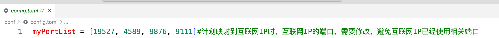
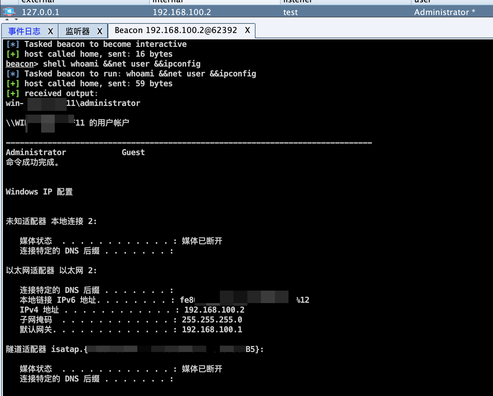

Dlam可从**hunter**、**quake**、**fofa**等**网络空间测绘平台收集、探测互联网IP**，检测其中可使用的IP，并通过本工具配置文件中的端口映射关系，把本地端口映射到互联网IP指定的端口，以便通过互联网IP访问本地端口服务。本工具基于[frp](https://github.com/fatedier/frp)修改。
> **开发不易,如果觉得该项目对您有帮助, 麻烦点个Star吧**

### +++免责声明+++

本工具仅面向合法授权的企业安全建设行为。

在合法使用本工具时，您应确保该行为符合当地的法律法规，并且已经取得了足够的授权。

如您在使用本工具的过程中存在任何非法行为，您需自行承担相应后果，我们将不承担任何法律及连带责任。

在安装并使用本工具前，请您务必审慎阅读、充分理解各条款内容，限制、免责条款或者其他涉及您重大权益的条款可能会以加粗、加下划线等形式提示您重点注意。 除非您已充分阅读、完全理解并接受本协议所有条款，否则，请您不要安装并使用本工具。您的使用行为或者您以其他任何明示或者默示方式表示接受本协议的，即视为您已阅读并同意本协议的约束。

### 0x01 说明

1. 本工具主要解决通过互联网IP访问本地端口服务的问题，即：把本地端口映射到某些互联网IP的端口上
2. 适合无固定互联网IP时使用
3. 适合防溯源时使用
4. 不要把本地有漏洞的服务映射到互联网

### 0x02 使用

1、修改myPortList的值为自己想映射到互联网IP上使用的端口，此处的端口为互联网IP的端口，需要避免可能已被使用的端口。检测互联网IP是否可用，后续使用过程中访问本地服务时，通过互联网IP:此处的PORT来访问

2、修改测绘平台key信息，使用哪个，就修改哪个的switch='open'

3、./dlam check命令执行程序，获取可用的互联网IP

4、执行check命令后，此时，可以看到config.toml中的whoseInternetAddress已存入了可用的互联网IP，此时可以关闭各空间测绘的开关，后续再执行check命令时，会自动取此处的互联网IP来检测，当此处的IP都不可用时，再打开测绘平台的开关重新获取即可。

5、在config.toml中配置dnats，把本地端口和对应的互联网IP:PORT对应起来（有多种对应形式）,举例如下

6、配置好之后，直接./dlam无命令启动程序，就可以通过互联网IP:PORT来访问本地服务了

### 0x03 效果举例

1、cs反连

本地端口远程端口保持一致

启动监听,此处IP要设置公网IP

监听如下：

执行payload，反连成功

如以往一样操作：

2、nc反连

3、其他同理......
